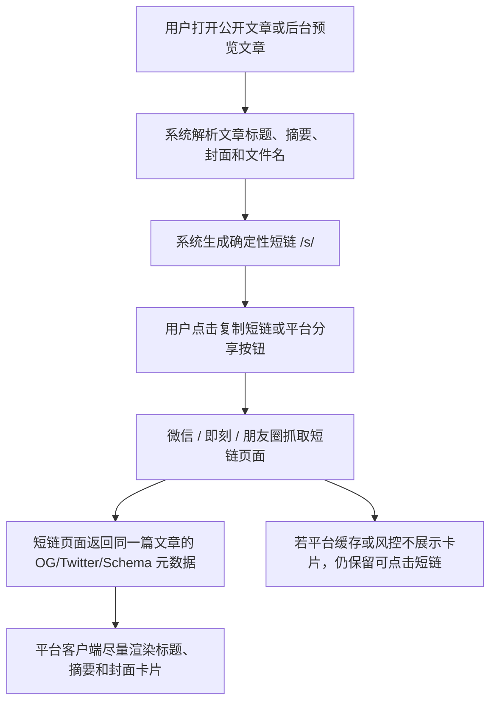

# PRD：文章短链与社交分享卡片

日期：2026-06-11

## 用户流程

## 页面与交互

- 公开文章页：
  - `<head>` 输出完整分享元数据。
  - canonical 指向原长文章 URL。
  - `og:url` 和分享脚本使用短链。
- 后台登录态文章页：
  - 摘要分享区保留复制按钮。
  - 按钮文案调整为复制短链。
  - 增加即刻分享入口。
  - 微信/朋友圈依赖微信内置菜单，页面脚本只负责配置分享卡片。
- 短链页：
  - 路由 `/s/<code>`。
  - 直接渲染文章页，不跳外部服务。
  - 找不到短码时返回公开 404。

## 平台行为

- 微信好友与朋友圈：
  - 使用现有 `/admin/api/wechat/share-config` 生成 JS-SDK 签名。
  - 页面调用 `updateAppMessageShareData` 和 `updateTimelineShareData`。
  - 分享字段为标题、摘要、短链、封面。
- 即刻：
  - 提供打开即刻 Web 的分享入口。
  - 卡片展示依赖平台抓取短链页面的 Open Graph / Twitter Card 元数据。
- 其它平台：
  - X/Twitter、LinkedIn 等继续读取 OG/Twitter 元数据，分享 URL 优先短链。

## 异常状态

- 短码不存在：返回 `public_article_404.html`。
- 微信凭据缺失：JS-SDK 配置接口返回 `configured=false`，页面仍保留普通短链分享。
- nginx 未配置 `/s/`：线上短链会 404，发布验证必须覆盖。

## 验收映射

- A2/A7：pytest 覆盖短码生成、短链路由、旧长链。
- A3/A4/A5/A6：分享 harness 验证 HTML 和 JS 字段。
- A8：`py_compile`、pytest、harness。
- A9：curl 验证线上 `/s/<code>` 和 nginx 状态。
