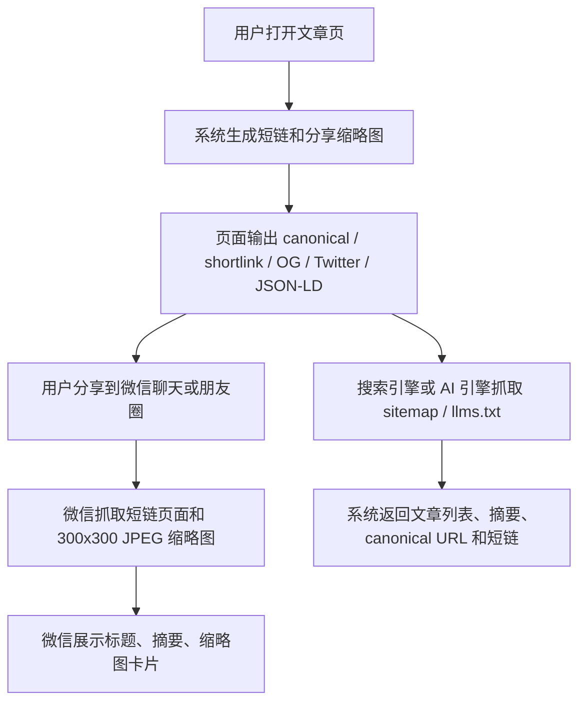

# PRD：分享卡片与 GEO 强化

日期：2026-06-12

## 用户流程

## 功能范围

- 文章页：
  - `rel=canonical` 指向长链。
  - `rel=shortlink` 指向短链。
  - `og:url`、`twitter:url`、微信分享 link 指向短链。
  - `og:image` 指向生成的 300x300 JPEG 分享缩略图。
  - JSON-LD Article 补日期、关键词、主页面、短链。
- 短链页：
  - `/s/<code>` 直接渲染文章，不重定向。
  - 输出与长链一致的卡片元数据。
- GEO 文件：
  - `/sitemap.xml` 动态输出根页面、文章列表页、所有文章 canonical URL。
  - `/llms.txt` 动态输出站点简介、入口、最近文章标题/摘要/canonical/short URL。

## 平台说明

- 微信/朋友圈：优先通过微信内置浏览器分享菜单和 JS-SDK 生效；普通粘贴 URL 是否展示卡片受微信客户端策略与缓存影响。
- 即刻/X/其它平台：通过 Open Graph / Twitter Card / Schema.org 元数据读取卡片。
- 搜索引擎/GEO：canonical 长链用于索引，shortlink 用于人类分享和 AI 引用便利。

## 异常状态

- 原图不存在或 PIL 转换失败：回退原图 URL，并记录 warning。
- sitemap/llms 无文章：仍输出根入口和文章列表页。
- 微信接口不可用：页面保留卡片元数据，share-config 降级 `configured=false`。

## 验收映射

- A3/A5：wechat_share_harness + curl image header。
- A4/A7：pytest + HTML grep。
- A6/A8：seo_geo_harness + curl `/sitemap.xml` `/llms.txt`。
- A9：nginx -t、systemctl active、线上 curl。
