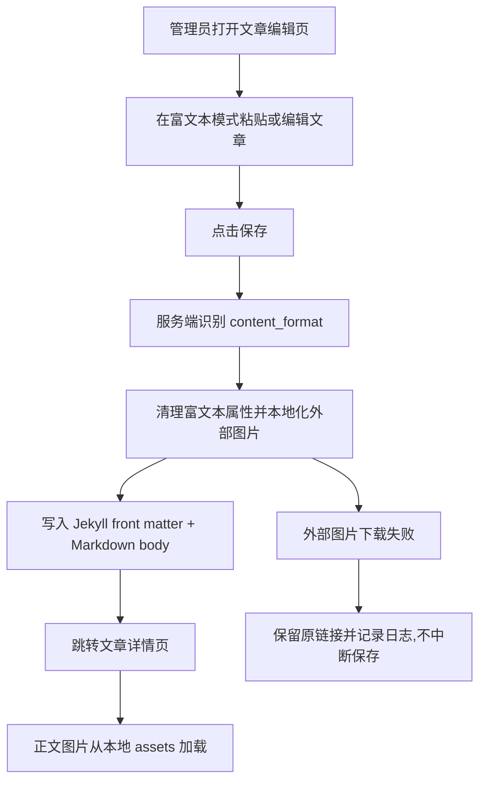

# PRD: 文章编辑图片本地化与保存清洗

日期: 2026-06-14

## 背景

文章编辑页支持 TinyMCE 富文本编辑。用户从钉钉文档等富文本来源复制内容后,浏览器剪贴板可能包含外部临时图片链接和平台内部元数据。若保存时直接写入 Markdown 文件,文章会依赖不可长期访问的第三方临时资源,后续阅读时图片失效。

## 用户流程

## 功能行为

- 富文本模式:
  - 保存入口读取 `content_format=rich_html`。
  - 服务端对 HTML 做清理和 Markdown 转换。
  - 图片标签中的外部 URL 在安全校验后下载到本地富文本图片目录。
  - `data-*`、`style`、事件属性和钉钉剪贴板属性不写入文章文件。
- Markdown 模式:
  - 原生 Markdown 继续原样保存。
  - 若用户在 Markdown 文本框误粘贴 HTML,沿用已有 HTML 转 Markdown fallback。
- 异常分支:
  - 外部图片无法下载或不是图片时,保存不中断,日志记录脱敏后的域名和失败原因。
  - 私有网段、localhost、file URL、超大图片和非图片响应会被拒绝下载。

## 兼容要求

- 不改变文章编辑页 URL、提交按钮和预览接口的用户行为。
- 不改变上传页富文本上传图片 API。
- 不改变公开文章 `/articles/<filename>.md`、短链 `/s/<code>` 和分享页 `/c/<code>`。
- 已经存在的本地图片路径如 `/PolaZhenjing/assets/...`、`/assets/...`、`{{ site.baseurl }}/assets/...` 不重复下载。

## 成功状态

- 管理员保存文章后,文章文件体积不再因剪贴板属性异常膨胀。
- 公开文章详情页图片稳定加载。
- 指定故障文章完成一次线上修复并留有备份。
