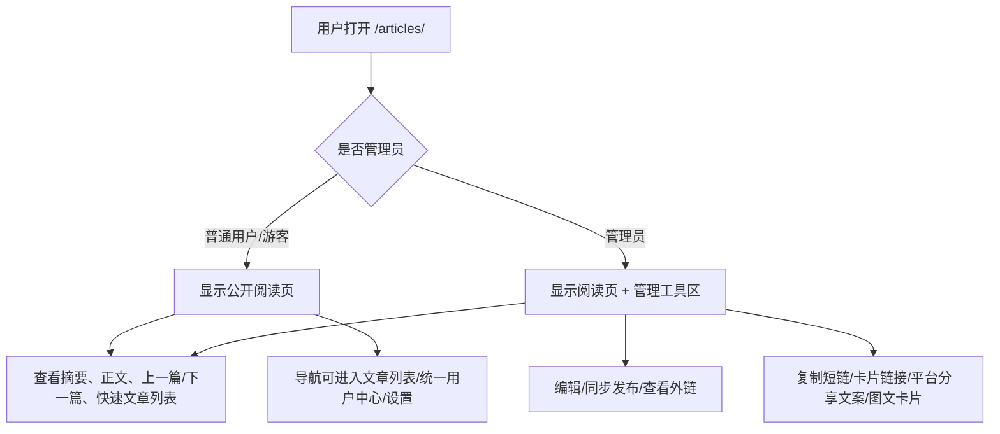

# PRD: 文章浏览页普通用户/管理员体验分流

日期: 2026-06-14

## 产品口径

文章详情页应该优先是一个阅读页面。普通用户看到的是干净的文章、摘要、上下篇和快速文章切换;管理员在同一页面额外看到管理工具和多平台分享工具。

## 用户流程

## 页面结构

### 顶部导航

- 普通用户/游客:
  - 品牌: `织梦空间`
  - 链接: 文章列表、统一用户中心、设置、登录/退出。
  - 不出现“管理后台”命名和后台功能集合。
- 管理员:
  - 保留后台导航: 上传、文章、发布、Skills、小王记忆、主题、用户、密码、退出。

### 文章详情页

- 顶部:
  - 返回文章列表。
  - 管理员右侧显示编辑、同步发布、查看。
  - 普通用户右侧不显示这些按钮。
- 标题区:
  - 标题、日期、阅读时间、分类/标签。
  - 单一摘要区域: 使用 `summary/description/share_description`。
- 管理工具区:
  - 仅管理员可见。
  - 将所有分享/管理动作集中到一个区域,减少重复。
- 正文:
  - 不受权限影响,普通用户与管理员阅读一致。
- 文章切换:
  - 上一篇/下一篇。
  - 快速文章列表,显示最近若干篇文章标题和日期。

## 异常与空态

- 没有上一篇或下一篇时,对应按钮显示不可用状态。
- 文章列表为空时,快速文章列表显示“暂无其他文章”。
- 未登录普通访客仍可看公开文章,导航显示登录入口。

## 兼容性

- 保留 SEO / Open Graph / Twitter card / JSON-LD meta。
- 保留管理员后台 URL。
- 保留现有短链 `/s/<code>` 和卡片页 `/c/<code>`。
- 不改变文章文件格式。
