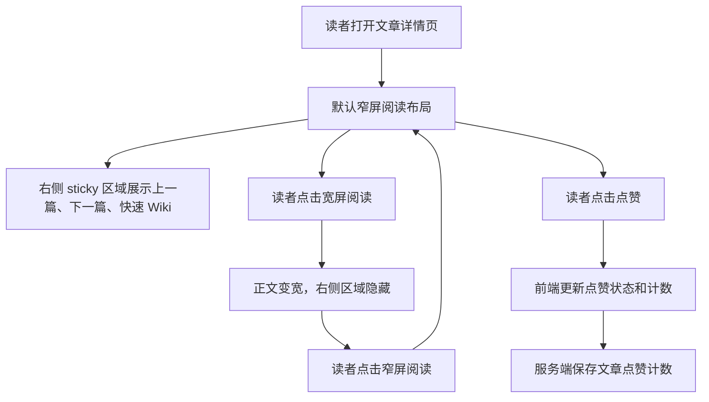

# PRD：文章阅读页右侧辅助导航与点赞

## 用户流程

## 页面布局

- 顶部：返回文章列表、阅读模式切换按钮、管理员工具入口。
- 正文主区：标题、元信息、摘要、管理员工具、正文、作者信息。
- 右侧辅助区：桌面端位于正文右侧，`position: sticky`，滚动时吸顶；移动端自然下排。
- 点赞：放在标题下方的阅读操作区，普通用户和管理员均可见。

## 状态

- 默认：窄屏，右侧辅助区可见。
- 宽屏：正文最大宽度扩大，右侧辅助区隐藏。
- 已点赞：按钮处于选中态，浏览器本地记录该文章已点赞。
- 点赞失败：按钮恢复原状态，不阻断阅读。

## 权限

- 点赞公开可用，不要求登录。
- 管理员工具仍仅管理员可见。
- 右侧快速 Wiki 对普通用户和管理员都可见。

## 空态与异常

- 没有上一篇或下一篇时显示“已经是最新文章/最后一篇”。
- 没有快速 Wiki 时只展示上一篇/下一篇。
- 点赞 API 失败时保留页面可读，不弹出阻断式错误。

## 兼容要求

- `/articles/<filename>`、`/PolaZhenjing/articles/<filename>`、短链 `/s/<code>` 的阅读体验保持一致。
- 不改变 Open Graph、JSON-LD、微信分享脚本和管理员分享工具。
