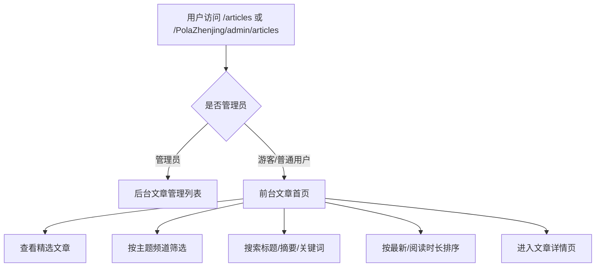

# PRD: PolaZhenjing 前台文章首页

日期: 2026-06-15

## 产品口径

PolaZhenjing 的普通用户首页不是后台列表,而是一张知识地图:让用户快速知道这里有什么、最近写了什么、哪些主题值得继续读,并能按兴趣搜索和筛选。

## 参考抽象

- Lil Log: 以作者和长期主题为中心,目录感强,适合知识沉淀。
- Ben Evans: 简洁、克制、观点型文章首页,强调最近更新和精选阅读。
- 掘金: 搜索、频道、排序和信息流,适合快速浏览。
- `aipd.me`: 视觉上应延续克制、绿色/金色点缀、轻玻璃和知识空间气质。

## 用户流程

## 页面结构

### 顶部 Hero

- 品牌: `PolaZhenjing`
- 副标题: `AI 产品、Agent 工作流、企业软件与知识生产笔记`
- 统计: 文章数、主题数、总字数/阅读时长。
- 动作: 开始阅读、RSS、JSON Feed、LLMs。

### 精选区

- 显示最近/首篇文章的大卡片。
- 使用标题、摘要、日期、阅读时间、主题标签、封面。
- 有明确阅读全文入口。

### 频道区

- 频道来源:
  - `section` 字段。
  - `keywords` 前若干高频标签。
- 显示全部、频道按钮和数量。
- 点击后过滤文章列表。

### 工具条

- 搜索框: 标题、摘要、关键词匹配。
- 排序:
  - 最新优先。
  - 阅读时长。
  - 标题。
- 空态: 无匹配文章时提示调整搜索或频道。

### 文章时间线

- 主列表为 Wiki/日志式信息流。
- 每篇文章显示: 日期、标题、摘要、主题、阅读时间、关键词、短链。
- 优先文章内容,封面只作为辅助,不让列表变成营销卡片瀑布流。

## 权限行为

- 游客和普通登录用户:
  - 前台轻导航。
  - 看不到后台导航、编辑、同步发布等管理入口。
- 管理员:
  - `/admin/articles` 仍是后台管理列表。
  - 可通过公开 `/articles` 查看前台首页。

## 空态与异常

- 无文章: 显示空态,保留返回织梦空间入口。
- 无筛选结果: 显示“没有匹配文章”。
- 文章缺封面: 使用文字型占位和主题色。

## 兼容性

- 保留现有公开路由 `/articles`。
- 保留非管理员访问 `/admin/articles` 时的前台渲染。
- 保留 JSON-LD `ItemList`、canonical、RSS/JSON feed。
- 不改变文章详情页和短链协议。
