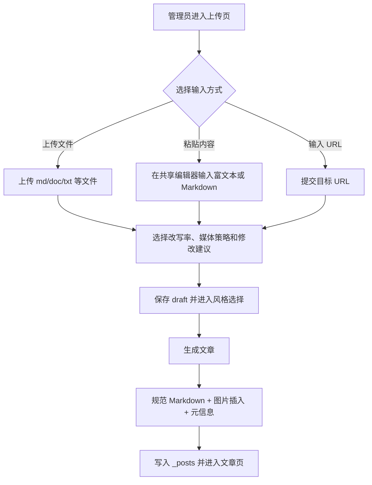
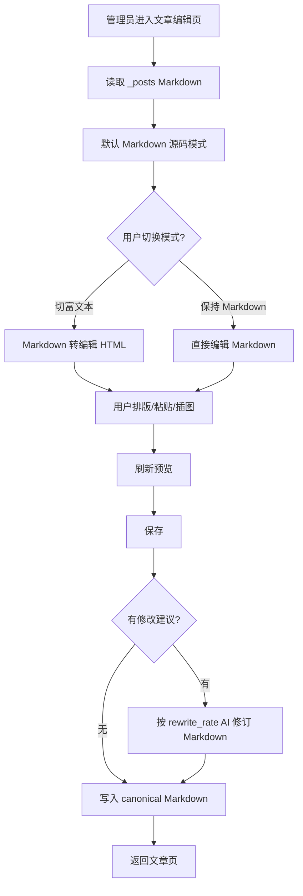

# PRD：上传与编辑模块系统性重构

日期：2026-06-19

## 产品目标

将 PolaZhenjing 的文章生产体验从“两个页面各自维护编辑器”升级为统一、稳定、可验证的文章生产工作台。管理员可以在上传和编辑阶段自然使用富文本或 Markdown，AI 改写和修改建议始终基于清晰正文执行，预览与最终保存一致。

## 用户流程

### 上传新文章

### 编辑已有文章

## 页面规格

### 共享正文编辑器

- 控件：`富文本编辑` / `Markdown 源码` segmented radio。
- 初始模式：
  - 上传页：默认富文本，允许切换 Markdown。
  - 编辑页：已有 `.md` 默认 Markdown，允许切换富文本。
- 切换规则：
  - Markdown -> 富文本：调用后端转换接口，把 Markdown 渲染为可编辑 HTML。
  - 富文本 -> Markdown：调用后端转换接口，把编辑 HTML 转为 canonical Markdown。
  - 转换失败时保留当前内容并显示错误，不覆盖用户输入。
- 提交规则：
  - 提交前统一把当前内容转为 canonical Markdown。
  - 后端再次校验，不信任前端隐藏字段。

### 预览

- 上传和编辑共用“保存等价预览”。
- 预览显示最终文章 HTML，而不是 raw Markdown 或 raw HTML。
- 预览失败时显示错误原因，不清空编辑内容。

### AI 改写率

- 上传页默认 `100%`，保持历史上传生成体验。
- 编辑页默认 `50%`。
- 编辑页仅在“修改建议简述”非空时触发 AI。
- 0% 表示不改写正文，但仍允许保存、图片规范化和元信息保留。

### 修改建议简述

- 位置：编辑页正文下方保存区。
- 行为：填写后点击保存，系统先将当前内容转 canonical Markdown，再按 rewrite_rate 调用 AI 修订。
- 异常：AI 调用失败时回退到原 canonical Markdown 并显示 flash warning，不让保存动作整体失败。

## 状态和错误

| 状态 | 页面反馈 |
| --- | --- |
| 编辑器加载中 | 显示 textarea 兜底，不阻塞输入 |
| TinyMCE 初始化失败 | 显示提示，保持 Markdown textarea 可用 |
| 模式转换失败 | toast/inline error，当前模式内容不丢 |
| 预览失败 | 预览区显示错误，不覆盖正文 |
| 保存失败 | 表单保留用户输入并显示错误 |
| AI 失败 | 降级保存原正文或提示用户重试，错误不泄露 secret |

## 功能关系和重复性检查

- `upload.html` 和 `article_edit.html` 当前重复编辑器逻辑，本次合并为共享 controller。
- `app/uploader.py` 当前同时承担路由和业务服务，本次保留路由，抽出正文、仓储、AI、媒体、工作流服务。
- `app/social_publish.py` 继续消费 `_posts`，不参与重构。
- 公开文章页、短链和分享卡片继续读取同一 Markdown 产物。

## 验收

详见需求记录 A1-A10。本 PRD 的页面体验验收重点为：

- 上传页三种输入方式仍可用。
- 上传页和编辑页切换模式无内容丢失。
- 编辑页预览和保存后的文章展示一致。
- 修改建议简述可保存成功。
- AI 改写率和 0% 跳过逻辑可测。
