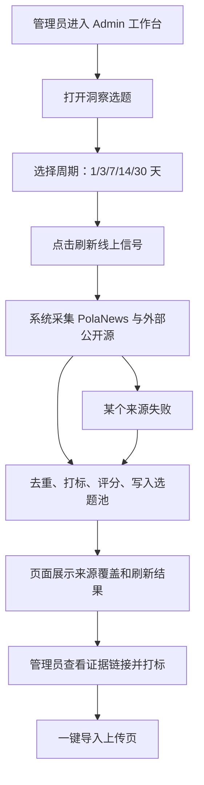

# PRD：每日选题全网抓取

日期：2026-06-20

## 1. 产品口径

“洞察选题”不再默认等同于钉钉/AI 表格条目，而是一个可追溯的内容雷达。它从 PolaNews 站内新闻池和外部公开社区/技术源抓取最近周期信号，合并成可写作的选题卡片。

## 2. 用户流程

## 3. 页面与控件

入口：`/admin/insights/topics`

- 顶部说明：说明当前来源为 PolaNews + 外部公开源，钉钉底料保留为人工参考。
- 刷新区：周期选择、刷新按钮、最近刷新时间、抓取信号数、生成选题数、失败来源。
- 筛选区：复用状态筛选。
- 选题卡片：
  - 日期、状态、来源类型、来源数量、评分。
  - 标题、角度、摘要、标签。
  - 证据链接列表，最多展示 3 条。
  - 状态保存、一键导入上传、查看来源。

## 4. 状态与异常

- `new`：刷新新产生或未处理的选题。
- `selected`：管理员认为可写。
- `imported`：已导入上传。
- `archived`：已归档，不因刷新恢复为新。
- 部分来源失败：显示 warning，但保留成功来源结果。
- 全部来源失败：保留旧选题并提示失败。
- 网络超时：单来源短超时，不阻塞整个刷新。

## 5. 兼容要求

- 旧 `data/insight_topics.json` 数组格式继续可读。
- 旧选题没有新字段时自动补默认值。
- 一键导入上传页不改变现有参数 `insight_topic`。

## 6. 非目标

- 不实现自动定时任务。
- 不接入需要登录态的 X/Twitter。
- 不把全文大数据写入本地，只保存短摘要和 URL。
