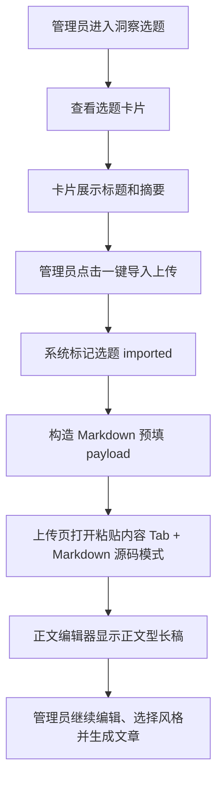

# PRD：每日选题 5000 字底稿

日期：2026-06-20

## 1. 产品口径

每日选题不是简单标题列表，而是“可直接进入写作流程的洞察草稿池”。管理员刷新或查看选题时，每条选题都应具备标题、摘要、证据和一份可编辑的长底稿；列表必须优先服务扫描，只展示具体摘要；上传预填必须服务写作，导入正文型长稿，但不把来源、证据、评分、状态等运营元信息塞进正文。

## 2. 用户流程

## 3. 页面和交互

### 洞察选题列表

- 保留刷新面板、状态筛选、状态保存、一键导入和查看来源入口。
- 每张选题卡展示：
  - 标题、日期、状态。
  - 摘要。
- 卡片正文区不展示来源、证据、评分、标签、底稿字数。
- 不展示 `draft_markdown` 全文。

### 上传页

- 通过 `?insight_topic=<id>` 进入时：
  - 默认打开“粘贴内容”。
  - 默认选中 Markdown 源码。
  - 标题、标签、描述自动预填。
  - Markdown textarea 预填 5000-30000 可见字符的正文型长稿。
  - 正文型长稿包含导语、核心判断、影响、风险、结尾等正文章节。
  - 正文型长稿不包含状态、来源类型、评分、证据链接列表等选题池管理信息。

## 4. 异常和兼容

- 旧选题无底稿：读取时自动生成，保存时持久化。
- 证据链接为空：不影响列表摘要展示和上传长稿预填。
- 线上刷新失败：保留旧选题和旧底稿。
- 底稿过短：使用结构化章节自动扩展到最低长度。

## 5. 非目标

- 不做列表页全文展开。
- 不新增 AI 付费调用。
- 不新增定时任务。
