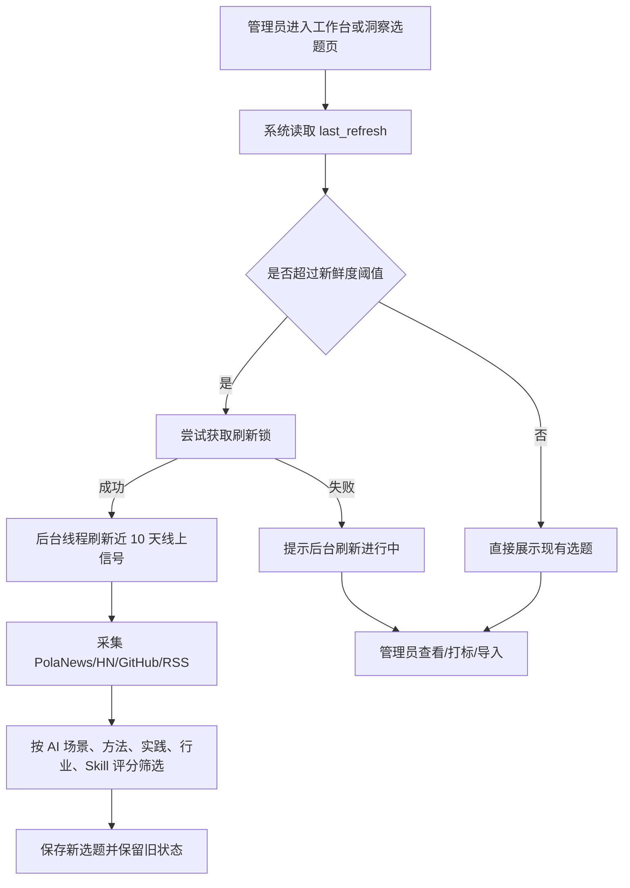

# SPEC：洞察选题自动刷新与质量聚焦

## 用户流程

## 规则

- 默认刷新周期：10 天。
- 允许刷新周期：1、3、7、10、14、30 天。
- 自动刷新开关：`POLAZJ_INSIGHT_AUTO_REFRESH`，默认开启。
- 自动刷新新鲜度：`POLAZJ_INSIGHT_AUTO_REFRESH_HOURS`，默认 20 小时。
- 自动刷新锁：`data/insight_topics_refresh.lock`，锁超过 1 小时视为陈旧并清理。

## 选题质量评分

单条信号必须在标题或摘要中具备可见 AI 核心相关性，不能仅依赖隐藏查询词或来源标签。

加权方向：

- AI 核心词：AI、LLM、Agent、OpenAI、Claude、人工智能、大模型、智能体等。
- 场景应用：workflow、application、场景、应用、落地、业务等。
- 方法论：methodology、framework、认知、框架、范式、判断等。
- 实践实现：practice、implementation、engineering、coding、最佳实践等。
- 行业组织：industry、enterprise、business、行业、企业、组织等。
- Skill/方案：skill、solution、automation、工具、技能、解决方案等。

## UI

- 选题页刷新面板在后台自动刷新启动时显示“已在后台自动刷新近 10 天线上信号”。
- 如果刷新锁存在，显示“后台刷新正在进行中”。
- 页面继续展示旧选题，不因外部源慢或失败而空白。

## 兼容性

- 旧 `data/insight_topics.json` 兼容。
- 手动刷新仍然同步执行并展示 flash。
- 选题状态 `new/selected/imported/archived` 保留。
- 一键导入上传仍使用长底稿正文，不带来源/评分等管理元信息。
