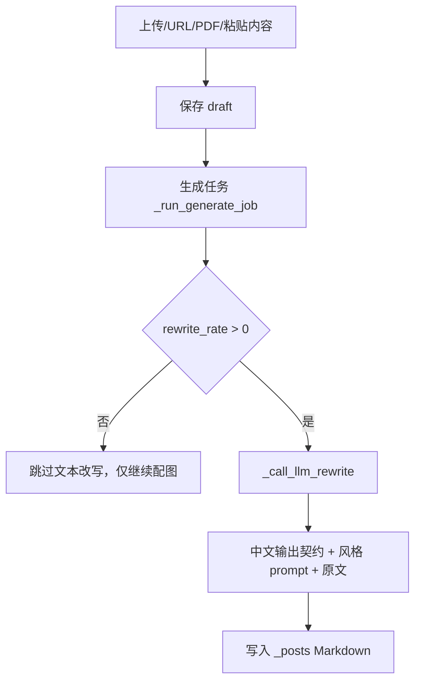

# 上传生成默认中文改写 SPEC / SDD

## 现状与根因

线上文章页面显示英文标题、英文摘要和英文正文，但同时已有中文图片 alt 与中文配图规划，说明图片生成链路正常，正文改写链路没有把英文素材强制转换为中文。

代码检查发现，非专属作者风格会走 `_GENERIC_REWRITE_PROMPT`。该 prompt 只要求“整理和优化”，没有明确要求“输出简体中文”或“英文素材先翻译成中文”。`rewrite_rate_instruction` 也只描述改写幅度，没有统一语言契约，因此模型可能忠实保留英文。

## 设计

- 在共享 AI 改写契约 `app/article_ai.py` 中增加中文输出要求。
- 在通用上传改写 prompt `app/uploader.py` 中增加语言边界。
- 在 `_call_llm_rewrite` 的用户消息中增加每次调用都携带的输出语言要求，避免某些 system prompt 没写语言约束。
- 保持 0% 改写跳过 LLM 的行为，因为 0% 的产品语义就是完全不改写。

## 数据流

## 兼容性

- 0% 改写保持原样，不翻译、不改写。
- 25%/50%/75%/100% 都必须输出简体中文。
- 代码块、命令、API、库名、论文名、链接可保留英文。

## 测试策略

- 单测断言 `_call_llm_rewrite` 请求体包含中文输出契约。
- 单测断言 `_GENERIC_REWRITE_PROMPT` 明确包含翻译约束。
- 回归执行上传改写率相关测试，确保 0%、50%、100% 行为不破坏。

## 回滚

如发现模型输出被过度翻译代码或专有名词，回滚本次 prompt 文案改动即可，不涉及数据迁移。
