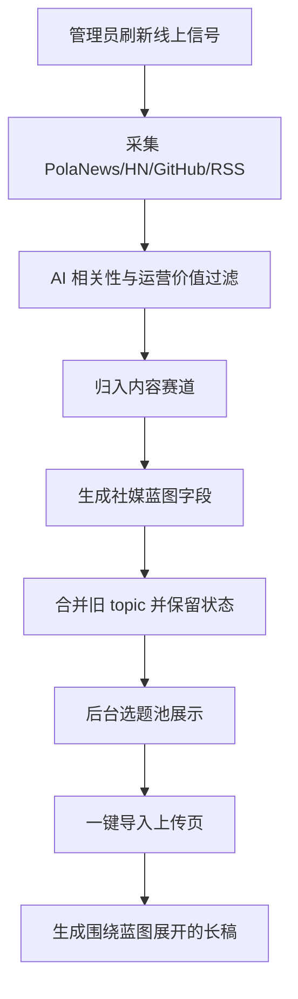

# PRD：AI 行业社媒运营选题蓝图

## 产品定位

`/PolaZhenjing/admin/insights/topics` 从“洞察文章选题池”升级为“AI 行业社媒运营选题池”。它应该帮助运营者每天快速判断：

- 哪些 AI 行业信号值得写；
- 应该从哪个内容赛道写；
- 面向谁写；
- 用什么钩子开头；
- 文章或短内容如何组织；
- 哪些证据只是支撑，不能直接搬运成新闻。

## 用户角色

- 管理员/运营者：浏览选题、筛选状态、选择 topic、一键导入上传页继续成稿。
- 普通用户：无后台权限，本次不改变。

## 核心流程

## 内容赛道

| 赛道 | 用途 | 典型问题 |
| --- | --- | --- |
| 场景使用 | 写 AI 在真实行业/岗位/流程中的新用法 | 这个能力进入了哪个真实工作流？ |
| 产品能力更新 | 写能力变化背后的产品机会 | 新能力会缩短哪个流程、改写哪个入口？ |
| 业务模式 | 写收费、交付、价值捕获和市场机会 | 从工具收费到结果交付，谁能拿到钱？ |
| 商业思考 | 写战略、组织、竞争和决策框架 | 这条信号为什么值得创业者和管理者重估？ |
| 最佳实践 | 写可复用方法、工程经验和使用原则 | 怎么做更稳，边界在哪里？ |
| 实践复盘 | 写真实尝试、失败原因、迁移路径 | 为什么 demo 可用但落地困难？ |

## Topic 字段

新增或强化字段：

- `content_lane`：机器字段。
- `content_lane_label`：中文赛道。
- `social_hook`：社媒开头钩子。
- `target_audience`：建议读者。
- `core_question`：文章应回答的问题。
- `content_structure`：3-5 个内容段落建议。
- `source_signal_title`：原始线上信号标题。
- `source_role`：说明来源只是证据切口。
- `draft_strategy_version`：草稿策略版本。

兼容字段保持：

- `title`、`angle`、`summary`、`tags`、`status`、`source_url`、`source_type`、`source_count`、`evidence_links`、`score`、`focus_score`、`draft_markdown`。

## 页面行为

- 页面主说明改为“面向社媒运营的 AI 行业选题池”。
- 刷新面板说明公开信号是素材来源，不是新闻搬运目标。
- Topic 卡片展示：
  - 内容赛道；
  - 标题；
  - 社媒钩子；
  - 目标读者；
  - 核心问题；
  - 建议结构；
  - 来源信号。
- 状态筛选、保存状态、一键导入上传保持不变。

## 异常与空态

- 外部源失败：保留现有选题，继续展示错误摘要。
- 信号相关但无法识别赛道：默认归到“商业思考”，避免新闻式标题。
- 旧 topic 缺少新字段：加载时自动补默认蓝图字段。
- 旧草稿策略缺失：再次规范化时生成新版运营蓝图草稿。

## 验收映射

- A1：`signals_to_topics` 单元测试验证标题转译。
- A2：单元测试验证每个 topic 有内容赛道。
- A3：单元测试验证社媒蓝图字段完整。
- A4：页面测试验证原始信号作为来源信号展示。
- A5：导入测试验证上传页长稿保留核心判断，不暴露管理态元信息。
- A6：既有刷新、状态、回填、自动刷新测试继续通过。
- A7：Harness JSON 覆盖 A1-A6。
