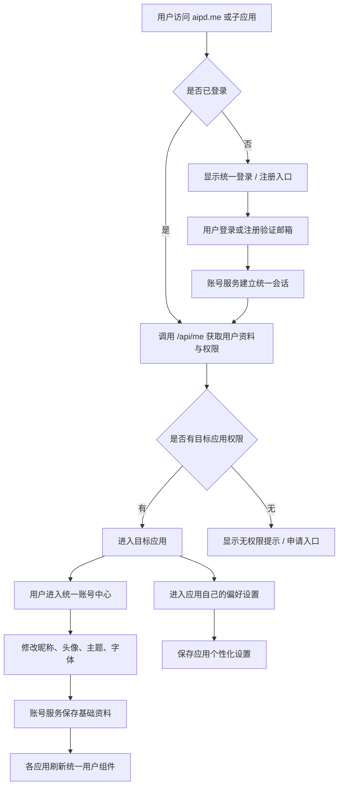

# PRD：AIPD 统一账号中心

日期：2026-05-21

## 需求口径

- 目标：将 `aipd.me` 下所有项目的用户中心、登录、注册、账号资料、角色权限、主题和字体设置统一到一套账号服务与前端组件中，避免各应用重复实现和状态不一致。
- 用户：普通用户、管理员、各子应用用户、后续接入 AIPD 应用的开发者。
- 输入：用户注册/登录信息、昵称、头像、主题/字体偏好、应用访问请求、应用个性化设置。
- 输出：统一登录态、统一用户资料、统一权限判断、统一账号管理页、跨应用可复用的用户组件/API。
- 非目标：本阶段不重写 PolaRead/PolaNews 的业务偏好系统，不做企业级 OAuth 开放平台，不做第三方社交登录。
- 假设：`PolaZhenjing` 暂作为统一账号服务宿主；后续如果规模扩大，可拆出独立 `/account` 或 `/auth` 服务。

## 范围

### 必须统一

- 登录、注册、邮箱验证、退出登录。
- 用户昵称、头像、邮箱、密码修改。
- 角色与权限：如 admin、user，以及 `articles.manage`、`skills.manage`、`polaread.use`、`polanews.use` 等。
- 全站基础偏好：主题设置、字体设置、语言/显示密度等可逐步扩展。
- 顶部用户入口组件：未登录显示“登录 / 注册”，登录后显示头像、昵称，点击进入统一账号中心。
- 管理员授权 UI：一期完成，可在统一账号中心内查看用户、处理权限申请、授予/撤销应用权限。
- 权限申请工作流：无权限时允许用户提交应用权限申请，管理员在授权 UI 中审批。

### 应用内独立保留

- PolaRead：语音、语速、播放偏好、阅读偏好、最近阅读记录。
- PolaNews：关注分类、推送时间、新闻源偏好、语言/地区。
- PolaZhenjing：文章生成默认主题、发布配置、编辑器偏好。
- Skill Hub/须弥山：Skill 展示方式、导入偏好、企业/团队级治理配置。

## 用户角色

- 未登录用户：可浏览公开门户，访问需要权限的应用时跳转统一登录。
- 普通用户：可管理个人资料、头像、主题、字体，可访问被授权的应用。
- 管理员：可管理文章、Skill、用户权限、项目入口，查看/调整用户角色。
- 子应用服务端：通过统一账号 API 校验会话和权限。

## 完整用户流程

## 功能界面布局

### 统一账号中心

- 顶部：用户头像、昵称、邮箱、角色标签。
- 基础资料区：昵称、头像裁剪上传、邮箱状态、密码修改入口。
- 外观偏好区：主题、字体、字号/显示密度（可折叠，高频项优先）。
- 权限与应用区：已开通应用、角色、权限列表、无权限申请提示。
- 应用偏好入口区：PolaRead、PolaNews、PolaZhenjing、Skill Hub 的专属设置入口。
- 管理员增强区：用户列表、角色授权、应用权限开关、审计记录入口。

### 顶部用户组件

- 未登录：黑金按钮“登录 / 注册”。
- 已登录：圆形头像 + 昵称；点击进入统一账号中心。
- 无头像：使用昵称首字母或默认黑金头像。
- 加载态：保持按钮占位，避免布局跳动。

### 子应用个性化设置

- PolaRead：在自身设置页管理语音、语速、播放偏好。
- PolaNews：在自身设置页管理关注分类、推送时间。
- 子应用页面可引用统一账号中心的“基础资料只读摘要”，避免重复编辑。

## 功能关系和重复性检查

- 已有相似功能：
  - `app/auth.py` 已有登录、注册、账户管理、头像、`api/me`。
  - `portal/assets/portal.js` 已有根门户登录态组件。
  - PolaRead/PolaNews 已存在 SSO 桥接方向。
- 复用/扩展关系：
  - 统一账号中心扩展 `app/auth.py`，不新建平行登录系统。
  - 根门户组件抽象成可复用 JS/CSS 组件，供 `agent.html`、`about.html`、首页复用。
  - 子应用只接入统一账号 API，应用偏好仍归各应用自身。
- 冲突风险：
  - 不同应用已有本地用户表/token，需做账号映射和兼容。
  - 权限若只在前端隐藏入口会被绕过，服务端必须校验。
  - 主题/字体如果由多个应用各自保存，会出现状态冲突。
- 取舍结论：
  - “基础身份与全站偏好”统一。
  - “应用业务偏好”分散保留，但入口从统一账号中心可跳转。

## 验收标准

- A1 文档：PRD 和 SDD 覆盖范围、非目标、用户流程、界面、接口、迁移、测试、部署和回滚。
- A2 用户流程：未登录、登录、注册、进入子应用、无权限、修改资料、修改主题字体、进入应用偏好路径均有定义。
- A3 UI：统一账号中心和顶部用户组件有明确状态：未登录、加载、已登录、无头像、无权限、保存成功/失败。
- A4 API：统一账号服务提供 `me`、login、register、logout、profile、preferences、permissions、session exchange/check 等接口。
- A5 权限：PolaZhenjing、PolaRead、PolaNews、Skill Hub 的服务端权限判断统一接入，不只依赖前端。
- A6 数据：用户基础资料、全站偏好和应用偏好边界清晰，旧数据可迁移或兼容。
- A7 回归：现有登录、注册、文章后台、Skill Hub、Agent 页面不因统一账号改造回归。
- A8 部署：上线前有数据库备份、灰度/回滚策略和生产验证清单。

## 风险和待澄清

- R1 PolaRead/PolaNews 当前本地用户模型需实现时复查，避免破坏已有用户数据。
- R2 是否需要跨子域 Cookie 目前不是问题，因为都在 `aipd.me` 路径下；若后续扩到子域，需要调整 Cookie domain 和安全策略。
- R3 主题/字体偏好是否即时影响所有应用，需要统一 CSS token 或各应用适配。
- R4 管理员授权页面是否本阶段完成，还是先通过后端配置/数据库操作管理。

## 确认项

- Q1 管理员授权 UI 是否一期完成：已确认，一期完成。
- Q2 主题/字体是否立即覆盖 PolaRead/PolaNews：已确认，立即覆盖。
- Q3 是否需要“应用权限申请”工作流：已确认，需要。
- Q4 PolaRead/PolaNews 当前生产数据结构是否需编码前复查：已确认，需要并检查，保证安全统一过渡。

## 生产结构复查摘要

- PolaRead：FastAPI + uvicorn，目录 `/opt/PolaRead`，本地用户表 `users`，应用偏好表 `user_settings`。其中 `tts_voice`、`tts_speed`、`auto_play_next`、`show_translation` 属于 PolaRead 个性偏好；`theme`、`font_family` 应迁移为 AIPD 统一偏好覆盖。
- PolaNews：Next 应用，目录 `/opt/polanews`，本地用户 `preferences` JSON 中包含 `language`、`theme`、`digest_time`、`categories`。其中 `digest_time`、`categories` 属于 PolaNews 个性偏好；`theme` 应由 AIPD 统一偏好覆盖，后续可扩展 font。

## 任务拆解

- T1 对应 A1/A2：确认 PRD/SDD 和功能边界。
- T2 对应 A4/A6：扩展统一账号数据模型和 API。
- T3 对应 A3：实现统一账号中心 UI 与可复用顶部用户组件。
- T4 对应 A5：接入 PolaZhenjing、Skill Hub、Agent 的权限校验。
- T5 对应 A5/A6：接入 PolaRead/PolaNews 的 session exchange 与本地账号映射。
- T6 对应 A7：完成回归测试和线上灰度验证。
- T7 对应 A8：部署、备份、回滚和发布记录。
